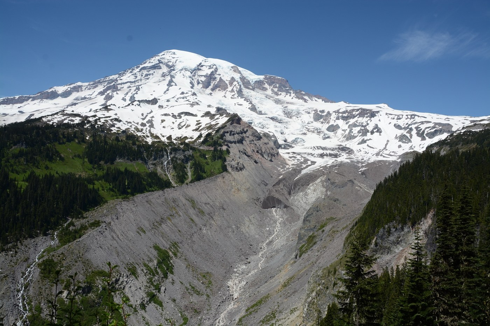

# **Gage Guesser**

Theo Ross and Ian Van Dusen

**Intro:**

The goal of this project is to estimate discharge rivers based on the several climatic factors occurring in the hydrosheds. We will look at different gages downstream of glaciers and collect shapefiles around their watersheds boundaries. We will retrieve climate data for each area and display influences of different climate metrics on discharge levels. Finally, we will train a machine learning model to predict discharge at specific gages.

**Research Question:** 

1. Based on several climate factors can we train a model to estimate discharge in a specific hyrdobasin?

2. To what extent does a glacier influence river discharge levels?

3. At what point in the season does diurnal melt control daily discharge readings?

**Datasets:**

USGS Gage Data --  [program to retreive data](https://github.com/USGS-python/dataretrieval)

NOAA Climate data

ERA Climate data

**Tools and Packages:**

python 3.8 
matplotlib 
numpy 
pandas 
geopandas 
jupyter 
shapely 
rioxarray 
scikit-learn  
dataretrieval 
folium? 

**Planned Methodology and approach:**

* We will choose a gage location 
	* draw shapefile around the hydroshed leading to the gage
	* clip climate data for ROI
	* test for correlation to discharge
	* visualize results
* Repeat these steps over multiple gage locations
* create a machine learning model based off of climate factors that predicts discharge over a specific region
* How will we account for landscape change and extreme weather events.... previous season rainfall/snowfall... Anomalies.........

**Expected Outcomes**

We anticipate discharge to be highly with climatic factors such as discharge. Regions with glacial influence on discharge will be heightened later in the season with warmer drier months as main snow melt has already occurred. 

